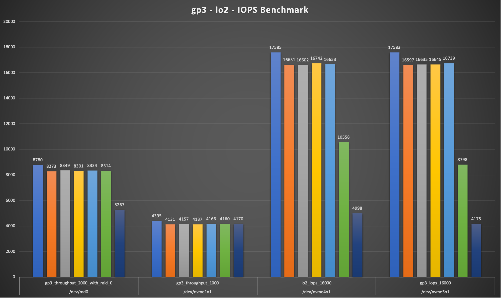
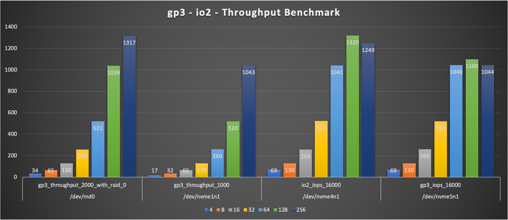

# EBS - GP3 - IO2 Volume Benchmarking with fio

Mystique Unicorn App has multiple components, some of which are throughput intensive and some of them are I/O intensive. They heard that the newly launched `gp3` ebs volumes offer better price-vs-performance ratio. Infact you could scale IOPS (input/output operations per second) and throughput without needing to provision additional block storage capacity.

Can you help them by running some benchmark tests against the new `gp3` and `io2` volumes and give your recommendations.

## 🎯 Solutions

The new gp3<sup>[1]</sup> EBS volumes balances price performance for a wide variety of transactional workloads. We will use `fio` for benchmarking<sup>[6]</sup> the peformance of your volumes.

   - **Throughput Scenarios**:
      - One `gp3` volume provisioned with `1000`MBs throughput
      - Two `gp3` volumes with each provisioned with `1000`MBs in RAID-0<sup>[2]</sup> to achieve a maximum throughput of `2000`MBs

   - **IOPS Scenarios**:
      - One `io2` volume provisioned with `16000` IOPS
      - One `gp3 volume provisioned with `16000` IOPS
   
There are some general guidance on achieving the optimal _IOPS_ and _throughput_ in the AWS docs<sup>[3]</sup>.

The size of an I/O operation determines the throughput the EBS volume provides. Amazon EBS calculates throughput using the equation: 

>`Throughput = Number of IOPS * size per I/O operation.` 

`gp2` and `io1` volumes can process a maximum I/O of `256`KiB. Let us calculate the same for `gp3`

The _size per I/O operation_ varies by volume type,
- **gp3** Per Volume supports,
   - Max IOPS = **16000**
   - Max Throughput = **1000**MiB/s 
   - Optimal volume I/O size: (1000MiB * 1024) / 16000 = **64**KiB


We will run our `fio` tests with different block sizes ranging from `4`, `8`, `16`, `32`, `64`,`128`,`256` to ensure the optimal perfromance for each of those volumes. We will also be performing only `randwrite` operations on our disk using `16` threads, each performing _write_ operations in its own `1`Gb file. Here is the global configuration for tests, _(You can also find these in the `scripts` directory of this repo)_. If you are unfamiliar with `fio`, take a look at the docs page,
   ```
   direct=1
   ioengine=libaio
   iodepth=16
   bs=4k
   size=1G
   numjobs=16
   time_based=1
   runtime=10
   norandommap=1
   group_reporting=1
   ```

## GP3 Benchmark Results

   The output of the `fio` tests are available under `fio_results` directory of this repo. I use the `fio_results*.csv` with excel to create some charts to visualize the performance of the disks.

   - **IOPS Tests**
      Clearly the `gp3` volume can sustain `16000` IOPS, same as the `io2` volume. But if you take the cost into consideration `gp3` is a clearly out performing the `io2` volume. As the _block size_ increases, performance drops, with the highest performance at `4`kb block size

      _Note: I have ran the test longer to upto 5 minutes, the results in _csv_ are for `10` second test duration._

      


   - **Throughput Tests**
      A single `gp3` volume gives a throughput of `1000`MBs. Whereas the _RAID-0_ volume max-es out at around `1300`MBs. I ran some ad-hoc tests with `block_size` going all the way upto `1M` still the performance of the RAID-0 never really goes near the `2000`MBs. If any of you know, how to improve the performance of the RAID volume or acheive sustained higher throughput(>1000MBs) do let me know.

      


## **Measuring Throughput Using CloudWatch**

If you already have a workload running on EBS volumes ou can use cloudwatch to measure your current throughput and IOPS and make a informed decision to migrate to the newer volumes. For each EBS Volume give find these two metrics `VolumeReadBytes` and `VolumeWriteBytes`.

- `VolumeReadBytes` - Provides information on the read operations in a specified period of time. The Sum statistic reports the total number of bytes transferred during the period.
- `VolumeWriteBytes` - Provides information on the write operations in a specified period of time. The Sum statistic reports the total number of bytes transferred during the period.

Both metrics give us the value in _bytes_, but we will conver them to MiB by dividing it by 1048576(1024 * 1024).
To get the **Total Throughput** in MiB/s we will use math expression to ((`VolumeReadBytes` + `VolumeWriteBytes`) / 1048576) / `SecondsInPeriod`.

Use the expression below, the function PERIOD is our friend here.

- `m1` = VolumeWriteBytes - Period `Sum`
- `m2` = VolumeReadBytes - Period `Sum`
- **Expression**: ((m1+m2)/1048576)/PERIOD(m1)

## 📌 Who is using this

This repository shows you how to benchmark EBS volumes to new developers, Solution Architects & Ops Engineers in AWS. Based on that knowledge these Udemy [course #1][103], [course #2][102] helps you build complete architecture in AWS.

### 💡 Help/Suggestions or 🐛 Bugs

Thank you for your interest in contributing to our project. Whether it is a bug report, new feature, correction, or additional documentation or solutions, we greatly value feedback and contributions from our community. [Start here](/issues)

### 👋 Buy me a coffee

[](https://ko-fi.com/Q5Q41QDGK) Buy me a [coffee ☕][900].

### 📚 References

1. [Amazon EBS GP3 Performance Limits][1]

1. [RAID Configuration on Linux][2]

1. [Optimal I/O size for EBS][3]

1. [Average throughput and number of IOPS][4]

1. [EBS I/O characteristics and monitoring][5]

1. [Benchmark EBS volumes][6]

1. [Block Volume Performance Tests on Linux][7]

1. [Block Volume Performance Benchmarkwith with multiple threads][8]

1. [Inspecting disk IO performance with fio][9]

### 🏷️ Metadata


**Level**: 300

[1]: https://aws.amazon.com/ebs/general-purpose/
[2]: https://docs.aws.amazon.com/AWSEC2/latest/UserGuide/raid-config.html
[3]: https://aws.amazon.com/premiumsupport/knowledge-center/ebs-calculate-optimal-io-size/
[4]: https://aws.amazon.com/premiumsupport/knowledge-center/ebs-cloudwatch-metrics-throughput-iops/
[5]: https://docs.aws.amazon.com/AWSEC2/latest/UserGuide/ebs-io-characteristics.html
[6]: https://docs.aws.amazon.com/AWSEC2/latest/UserGuide/benchmark_procedures.html
[7]: https://docs.cloud.oracle.com/en-us/iaas/Content/Block/References/samplefiocommandslinux.htm
[8]: https://www.scalebench.com/blog/index.php/2020/06/03/aws-ebs-vs-aws-instance-storelocal-disk-storage/
[9]: https://www.linux.com/training-tutorials/inspecting-disk-io-performance-fio/

[100]: https://www.udemy.com/course/aws-cloud-security/?referralCode=B7F1B6C78B45ADAF77A9
[101]: https://www.udemy.com/course/aws-cloud-security-proactive-way/?referralCode=71DC542AD4481309A441
[102]: https://www.udemy.com/course/aws-cloud-development-kit-from-beginner-to-professional/?referralCode=E15D7FB64E417C547579
[103]: https://www.udemy.com/course/aws-cloudformation-basics?referralCode=93AD3B1530BC871093D6
[899]: https://www.udemy.com/user/n-kumar/
[900]: https://ko-fi.com/miztiik
[901]: https://ko-fi.com/Q5Q41QDGK
